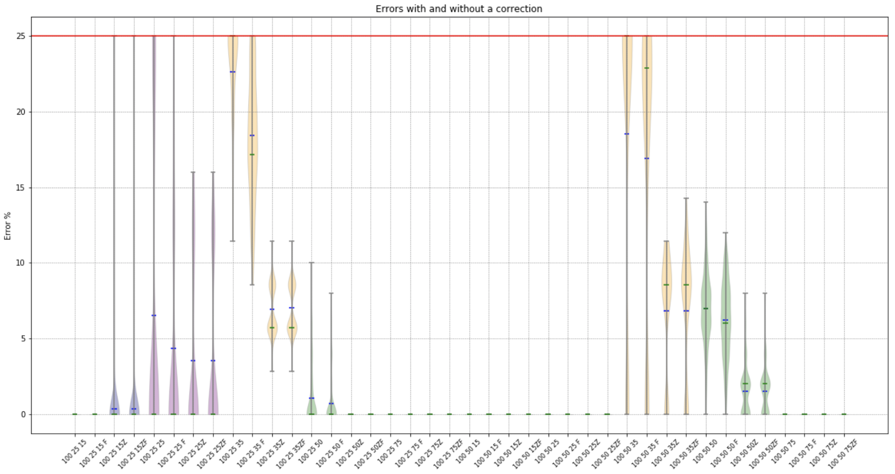
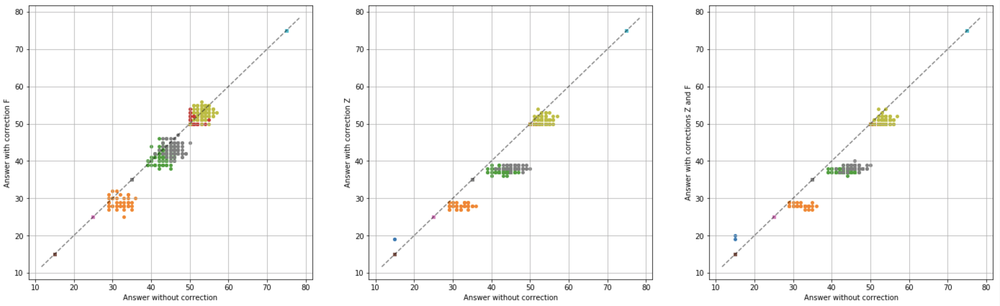
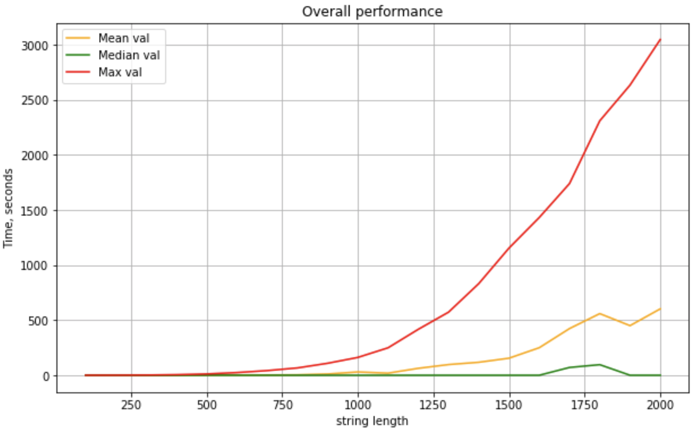
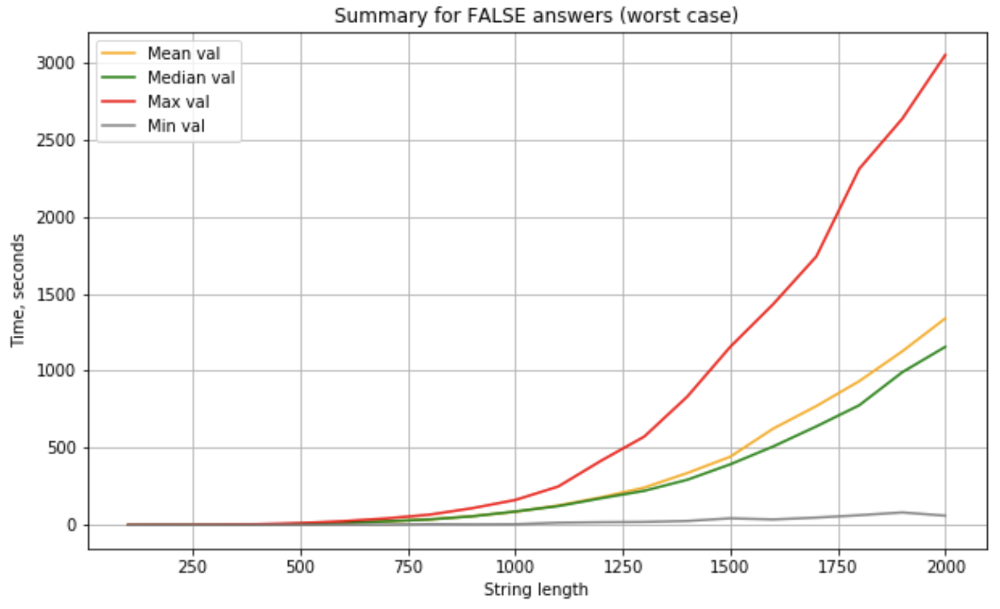
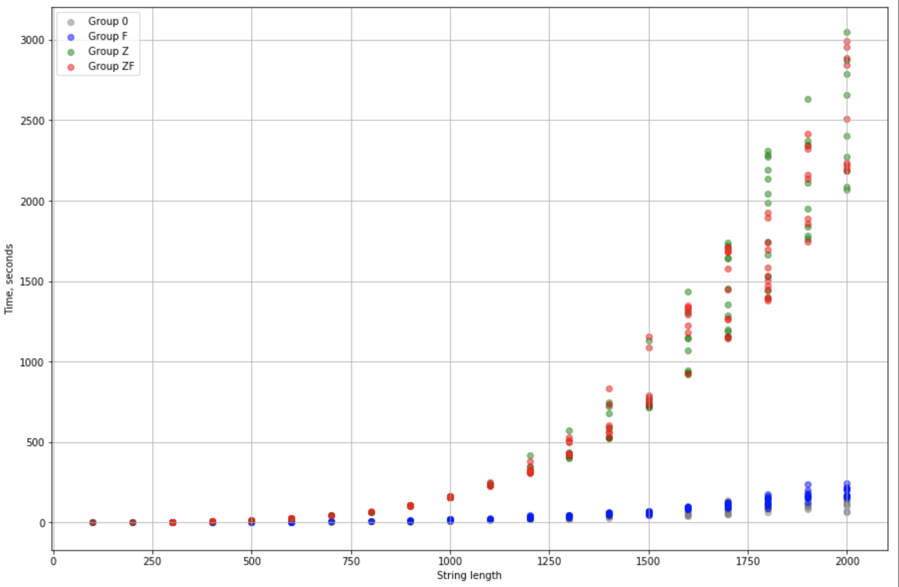

# BDCSP - Binary, Decisional, Closest String Problem version

[](https://gitlab.com/kirilenkobm/bdcsp/commits/master)

## What is the problem

Binary decisional closest string problem definition:

- Given a set of _str_num_ strings _S_ = {s1, s2, s3, ... sk} of length _str_len_ over the alphabet {0, 1}
- Also given a parameter _K_
- Question: is there a string _sc_ such as _d(sc, s)_ <= _K_ for each s ∈ _S_?

Where _d(s1, s2)_ is a Humming distance between stings _s1_ and _s2_.

This problem considered to be NP-complete.

Here, I suggest a polynomial approximation for this task with precision and performance measurements.

The algorithm is explained in detail in the following article:

<https://example.com>

Briefly, the suggested algorithm solves the problem in:

``` math
O(W^3 * H^2)
```

in the __worst__ case (if _K_ ~ 33% of string length, then the probability of the worst case is the hightest).

Where:

- W - string length
- H - number of strings

To achieve this, I developed some ideas, published in "Fixed-Parameter Algorithms for Closest String and Related Problems" by Jens Gramm, Rolf Niedermeier and Peter Rossmanith (Algorithmica, September 2003, Volume 37, Issue 1, pp 25–42) and added a couple of mine own solutions. Also, using the binary alphabet simplifies the search a lot.

## Usage

On linux/MacOS:

```shell
git clone git@gitlab.com:kirilenkobm/bdcsp.git
cd bdcsp/
make
```

On windows:

```bat
git clone git@gitlab.com:kirilenkobm/bdcsp.git
cd bdcsp\
.\Win_make.bat
```

To run tests/*.ipynb install requirements first:

```shell
pip install -r requirements.txt
```

To generate input files:

```shell
make rnd
./generate_input
```

To reproduce testing dataset:

```shell
./repeat_dataset.sh
```

Will compile random datasets generator in C

Program usage:

```txt
Usage: ./CSP [input file] [k] [-v] [-p]
[input file]: text file containing input or stdin
[k]: minimal distance to check, positive integer number
[-v] <number 0 .. 3>: enable verosity mode, set logging level from 1 to 3, 0 - nothing
[-h]: show this message
[-V]: show version
[-p]: show patterns
[-nr]/[--nr]: you promise there are no repetative strings (not recommended) =)
[-r]: render initial state (not recommended on big datasets)
[-f]: optimize first line
[-s]: sanity checks, just check the input correctness and quit
[-sr]/[--sr] <filaname>: save final render to file
[-z]: turn on magic mode
[-t]: transpose dataset
```

For better (in average) results, add -f and -z options.

Also, results might be improved with:

```shell
../call_for_each_line.py [input_file] [k]
```

Warning - takes _str_num_ times more operations!

In some cases, this also might be useful:

```shell
./iterative_call.py
```

In this case the program runs several times using the best state of the previous program.

## How it works

Briefly, the program is based on the following ideas:

- Let's imagine, that we have all possible strings of some length _L_. In this case the question of existence of the closest string is nonsense, because for each string _s_ it will exist a string _-s_ with all characters inverted, and the maximal distance will be equal to strlen.
- If we remove one string, let's say 0000, then 1111 will be the closest string, because a minus-string for the 1111 doesn't exist anymore. The maximal distance will be reached for strings like 1000, 0100, etc.
- Columns 1001 and 0110 mean the same thing in relation to other strings, they belong to the same class, so all 1000's might be replaced witn 0111's and vice versa.
- We can take strings containing only 1's as the closest string, and swap all columns in way to minimize the maximal distance, in our case - to minimize number of zeros in the string, containing the bigger number of zeros.
- We need only one instance of each string, duplicates can be removed.
- Columns containing only 0's or 1's might also be skipped.
- To satisfy the _K_  given we need to cover _col_num_ - _K_ columns
- If we swap all columns to make number of ones in our matrix as big as possible, we can sum up numbers of ones and divide to _str_num_, then we get __potentially__ the biggest number of covered columns. So we can simply measure the potentially smallest _K_.
- For the same "maximal number of ones" matrix we can measure the maximal _K_, which can be reached anyway. Meaning if we request this _K_ or bigger, we can skip computations and say "True". If a column has 2 zeros, then this column together with 2 any other columns will a priori cover a column, and so on.
- We also can get "average string" (if a columns has more 1's than 0's, then put 1 at this position in average string and vice versa). Then we can compute Humming distances to each string and get maximal _K_ (if requested this or bigger _K_ - return True).
- Also, we can apply the following logic - if maximal distance is 10 and the second is 6, we can shrink this number up to 8.

## Contents

- src/ - C source code, the algorithm implementation itself:
  - CSP.c/h - enrty point
  - read_input.c/h - read and check input
  - patterns.c/h - patterns-related operations
  - arrstuff.c/h - operations with arrays
  - render.c/h - hard to say
  - traverse.c/h - core algorithm
  - generate_dataset.c - generate dataset for BDCSP
- tests/ - folder for test files generated by generate_input.py
  - input_files/ - folder for input datasets
  - answers/ - folder with answers for each dataset
- metrics - folder for jupyter notebooks to evaluate tool precision and rerformance
- repeat_dataset.sh - script to reproduce dataset I used for evaluation
- Makefile and Win_make.bat - build instructions for Linux/MacOS and Windows
- run_tests.sh - shell script to check that everything builds and returns correct results for sample data
- shuffle_input.py - script to shuffle input making line N first
- requirements.txt - libraries required for performance tests and input generation in python
- Minor stuff:
  - LICENSE
  - .gitignore
  - .gitlab-ci.yml
  - CHANGELOG
  - README.md =)

## Precision measurements

Precision measurements were performed in the following way:

- Create testing dataset with "repeat_dataset.sh", 150 repeats for each combination of expected K, _str_len_ and _str_num_
  - To create an input file, first create a random string of _str_len_ given (I call it origin string)
  - Then, _str_num_ times swap K random characters of origin string, save resulting string
  - Thus, we know that in for this file it must exist a closest string with maximal distance K
- For each point we know the expected K, so we can check whether program will find it
- Call program for each file and given K with different corrections (-z, -f and -z -f flags)
- If the answer is False, this is an error, and we can compute the % of errors
- Plot these errors:



We see that the best results are obtained with -z and -f flags. Each 4 plots represent one dataset.
Dataset name is written as [str_len] [str_num] [K expected].
F, Z and FZ mean different corrections applied.
We see that in case of _K_ ~ 35% of strlen program gives the worst results even after corrections.
In average, F and Z corrections improve results.
However, if we compare different corrections with uncorrected model, we see that in a minority of cases it is better to call the program without any corrections:



## Performance tests

In the worst case algorithm shows complexity as O(W^3 * H^2).
However, in the best case program shows almost linear time.
It depends on the step where program found the answer. The search tree step is the bottleneck, and if the program fails to find the closest string at this stage, it actually is the worst case.
I performed performance tests on the dataset with fixed str_num (100 strings) and different str lengths (100 - 2000 characters).
Expected _K_ is 33% of _str_len_ in each dataset, to perform the tests on the potentially worst case.



As we can see, the runtime is highly variable, however is quite low in the average case. Actually, according the algorithm structure, the worst runtime will be shown for cases, where program failed to find the closest string.
The same plot for "only False" answers looks like:



Also the runtime depends on applied corrections, because with corrections the search is deeper in average. So this plot shows runtime in "False" case for different types of corrections:


